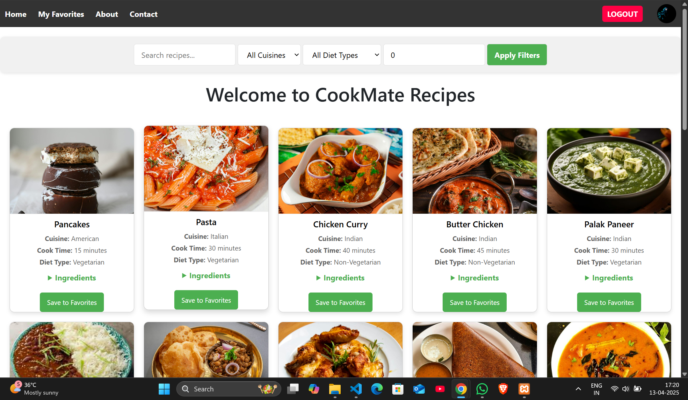
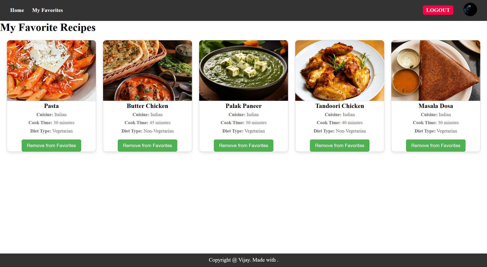
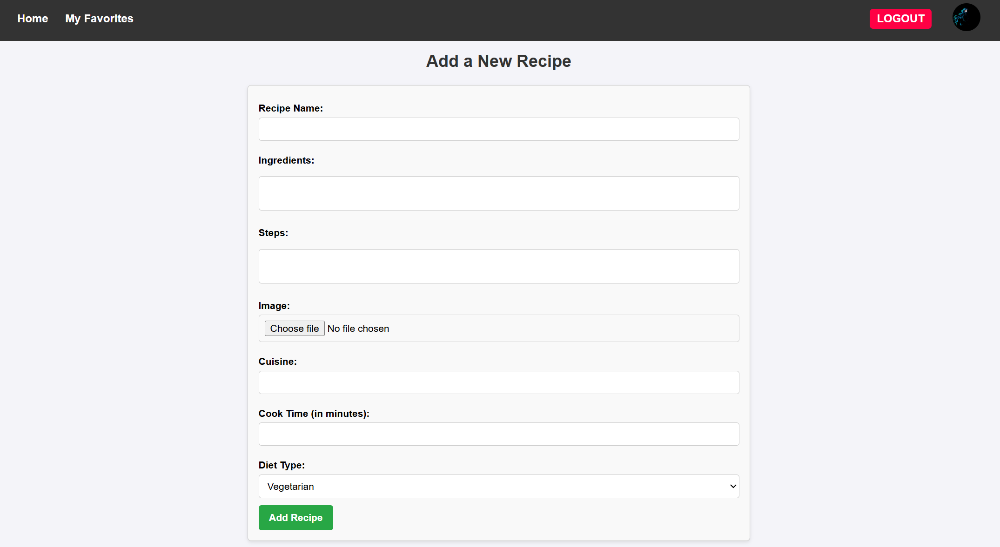
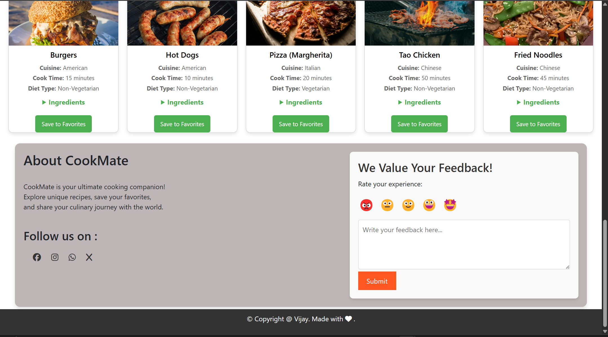

# 🍳 CookMate - Smart Recipe Recommendation Platform

**CookMate** is a personalized recipe recommendation web app where users can explore, save, and share their favorite dishes.
  Built using HTML, CSS, JavaScript, PHP, MySQL, and AJAX, the platform offers a seamless experience for foodies to discover new recipes based on their preferences.

---

## 🚀 Features

- 🔍 **Search & Filter** recipes dynamically using AJAX
- ❤️ **Save to Favorites** and manage personal recipe lists
- ⭐ **Rate & Review** recipes from the community
- 📝 **Upload Your Own Recipes** with ingredients and steps
- 👤 **User Profiles** with profile pictures and editable details
- 📱 Fully responsive and optimized for all devices

---

## 🛠️ Tech Stack

- **Frontend**: HTML, CSS, JavaScript, Bootstrap
- **Backend**: PHP
- **Database**: MySQL
- **AJAX**: For real-time search, rating, filtering, and profile updates

---

## 🖼️ Screenshots

### 🏠 Homepage

### ❤️ Favorites Page

### ⬆️ Upload Recipe

### 👤 User Profile  

### ✏️ Edit Profile  

### 💬 Feedback Page  

## 🙋‍♂️ Author

**Vijay Kumar**  
🎓 3rd Year Engineering Student, Osmania University  
🛠️ Project Type: Academic | Skill-building  
🌐 GitHub: [github.com/vijayKumar7909](https://github.com/vijayKumar7909)

